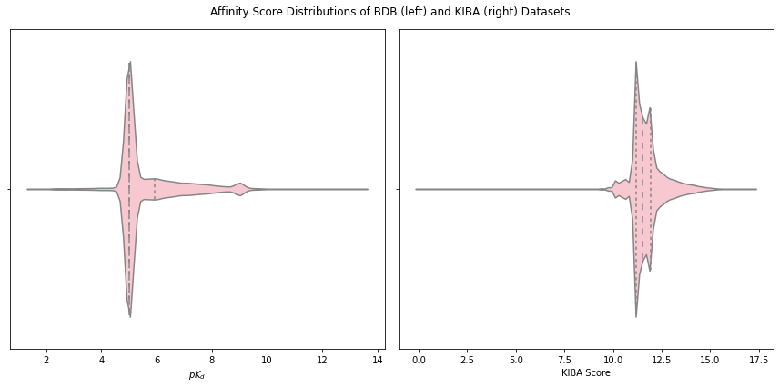

# Additional Information on BDB and KIBA

The following figure illustrates the binding score distributions and quartiles in the BDB and KIBA datasets. A strong peak at $pK_d = 5$ is observed for BDB, because $K_d$ of weak interactions are often recorded as $K_d \geq 10000$ $(pK_d \leq 5)$.

We create train/validation/test splits out of BDB and KIBA with warm and cold biomolecules (see the manuscript for more details). We report the average number of proteins, ligands, and interactions in the training and test sets in the following table, alongside standard deviations in the parentheses.

| Dataset | Fold         | #Proteins            | #Ligands               | #Interactions              |
| ------- | ------------ | -------------------- | ---------------------- | -------------------------- |
| BDB     | Train        | 403.4    $\pm$  2.8  | 740.8    $\pm$  19.46  | 17988.2     $\pm$  646.45  |
| BDB     | Validation   | 355.0    $\pm$  5.62 | 170.0    $\pm$  11.05  | 1494.2      $\pm$  56.17   |
| BDB     | Warm         | 354.4    $\pm$  3.44 | 179.6    $\pm$  5.28   | 1494.4      $\pm$  56.32   |
| BDB     | Cold Ligand  | 376.0    $\pm$  4.38 | 84.8    $\pm$  5.53    | 2448.8      $\pm$  373.48  |
| BDB     | Cold Protein | 43.6     $\pm$  2.15 | 264.8    $\pm$  90.17  | 2360.0      $\pm$  216.02  |
| BDB     | Cold Both    | 41.4     $\pm$  3.07 | 30.8    $\pm$  11.92   | 274.6      $\pm$  36.19    |
| KIBA    | Train        | 200.6    $\pm$  1.36 | 1834.6   $\pm$  6.41   | 77264.4     $\pm$  814.94  |
| KIBA    | Validation   | 193.0    $\pm$  1.67 | 1467.2   $\pm$  23.75  | 6650.2      $\pm$  69.53   |
| KIBA    | Warm         | 192.0    $\pm$  3.16 | 1476.2   $\pm$  17.7   | 6650.6      $\pm$  69.1    |
| KIBA    | Cold Ligand  | 193.0    $\pm$  2.45 | 140.0    $\pm$  5.59   | 6810.0      $\pm$  570.52  |
| KIBA    | Cold Protein | 14.6     $\pm$  0.8  | 1296.0   $\pm$  179.09 | 6259.6      $\pm$  1024.25 |
| KIBA    | Cold Both    | 14.0     $\pm$  1.1  | 100.2    $\pm$  14.55  | 468.6      $\pm$  37.89    |